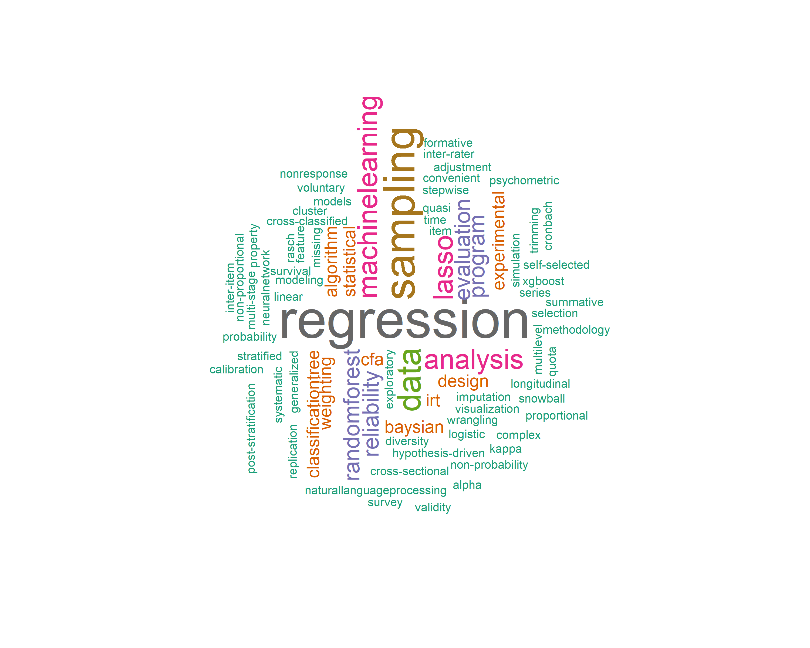

## About me

PhD Statistical research scientist with more than 10 years of experience with statistical data analysis an modeling, sampling and weighting, survey methodology, and experiemental design and program evaluation experience. Seeking opportunities to contribute to and grow with projects and groups that make positive impact on the society.  

Location:  Washington, D.C. Metro Area        
E-mail:    osurwj@gmail.com 

[Resume](https://github.com/weijia-ren/MyBio/blob/master/WEIJIA%20REN%20resume.pdf)         
[Linkedin](https://www.linkedin.com/in/weijia-ren-6b885311/)

## Education 

[The Ohio State University](https://www.osu.edu)   
Major: Quantitative Research, Evaluation and Measurement (QREM)   
Minor: Statistical data analysis  
Degree: PhD, 2011         

## Work Experience 

[Westat](http://www.westat.com)    
Position: Senior Statistician    
Year: 2011-2019 

## Research Interest        

## Programming language         
`SAS` `R` `Python` `SPSS` `SQL` `STATA` `WesVar` `Sudaan` `HLM` `WinBugs` `LISREAL` `AMOS` 

# Projects

